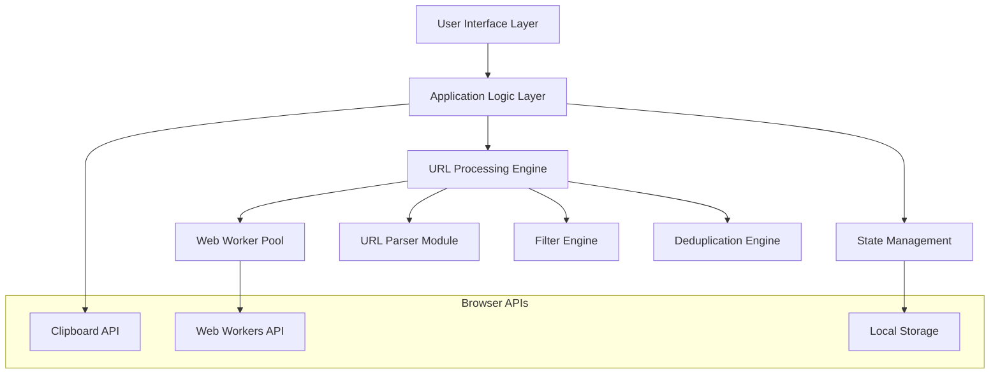

# Design Document

## Overview

The URL Manager is a single-page web application that provides a sophisticated interface for URL manipulation and management. The application uses a clean, modern design with a focus on usability and performance. The architecture emphasizes client-side processing, responsive design, and efficient handling of large datasets through web workers and optimized algorithms.

## Architecture

### High-Level Architecture



### Technology Stack

- **Frontend Framework**: Vanilla JavaScript (ES6+) for maximum performance and minimal overhead
- **Styling**: CSS3 with CSS Grid and Flexbox for responsive layout
- **Processing**: Web Workers for heavy URL processing operations
- **State Management**: Custom lightweight state manager
- **Build Tools**: No build process required - pure HTML/CSS/JS

## Components and Interfaces

### 1. Main Application Component (`URLManager`)

**Responsibilities:**
- Initialize the application
- Coordinate between UI components and processing engine
- Manage application state

**Interface:**
```javascript
class URLManager {
    constructor()
    init()
    processURLs(operation, options)
    updateUI(results)
    handleError(error)
}
```

### 2. UI Components

#### TextAreaManager
**Responsibilities:**
- Manage input and output text areas
- Handle text area interactions and events
- Provide copy/clear functionality

```javascript
class TextAreaManager {
    constructor(inputElement, outputElement)
    setInputText(text)
    getInputText()
    setOutputText(text)
    getOutputText()
    copyToClipboard()
    clear()
    updateStats(inputCount, outputCount)
}
```

#### ControlPanel
**Responsibilities:**
- Manage operation selection dropdown
- Handle process button interactions
- Manage additional input fields for filters

```javascript
class ControlPanel {
    constructor(containerElement)
    setOperation(operation)
    getOperation()
    getFilterString()
    isProcessAllEnabled()
    onProcessClick(callback)
    showLoading()
    hideLoading()
}
```

### 3. URL Processing Engine

#### URLProcessor
**Responsibilities:**
- Coordinate URL processing operations
- Manage web worker pool for heavy operations
- Handle different operation types

```javascript
class URLProcessor {
    constructor()
    process(urls, operation, options)
    removeParameters(urls)
    deduplicate(urls, type)
    filter(urls, type, filterString)
    keepTLDOnly(urls)
}
```

#### URLParser
**Responsibilities:**
- Parse and validate URLs
- Extract URL components (domain, subdomain, TLD, parameters)

```javascript
class URLParser {
    static parse(url)
    static isValid(url)
    static getDomain(url)
    static getTLD(url)
    static hasSubdomain(url)
    static removeParameters(url)
}
```

### 4. Web Worker Pool

**Responsibilities:**
- Handle CPU-intensive operations without blocking UI
- Process large datasets efficiently
- Provide progress updates

```javascript
// worker.js
self.onmessage = function(e) {
    const { operation, urls, options } = e.data;
    const result = processURLs(operation, urls, options);
    self.postMessage(result);
}
```

## Data Models

### URL Object
```javascript
{
    original: string,      // Original URL string
    parsed: {
        protocol: string,  // http, https, ftp, etc.
        domain: string,    // example.com
        subdomain: string, // www, api, etc.
        tld: string,       // com, org, net, etc.
        path: string,      // /path/to/resource
        parameters: object, // { key: value }
        fragment: string   // #section
    },
    processed: string,     // Result after processing
    valid: boolean        // Whether URL is valid
}
```

### Operation Configuration
```javascript
{
    type: string,         // 'removeParams', 'deduplicate', 'filter', 'keepTLD'
    subtype: string,      // For deduplicate: 'tld', 'domain', 'full'
    filterString: string, // For filter operations
    processAll: boolean,  // Whether to process all text or preview only
    caseSensitive: boolean // For filter operations
}
```

### Processing Result
```javascript
{
    success: boolean,
    inputCount: number,
    outputCount: number,
    removedCount: number,
    invalidCount: number,
    results: string[],
    errors: string[],
    processingTime: number
}
```

## User Interface Design

### Layout Structure

```
┌─────────────────────────────────────────────────────────────┐
│                        Header                               │
│                   URL Manager                              │
├─────────────────────────────────────────────────────────────┤
│                    Statistics Bar                          │
│  Input: 1,234 URLs | Output: 987 URLs | Removed: 247     │
├─────────────────────────────────────────────────────────────┤
│  Input Text Area          │        │  Output Text Area     │
│  ┌─────────────────────┐  │        │  ┌─────────────────┐   │
│  │                     │  │Control │  │                 │   │
│  │  Original URLs      │  │ Panel  │  │ Processed       │   │
│  │                     │  │        │  │ Results         │   │
│  │                     │  │[Drop▼] │  │                 │   │
│  │                     │  │[Input] │  │                 │   │
│  │                     │  │[☐All]  │  │                 │   │
│  │                     │  │        │  │                 │   │
│  │                     │  │[PROCESS│  │                 │   │
│  │                     │  │ BUTTON]│  │                 │   │
│  └─────────────────────┘  │        │  └─────────────────┘   │
│  [Clear] [Paste]          │        │  [Copy] [Clear]       │
└─────────────────────────────────────────────────────────────┘
```

### Design Principles Implementation

#### Hierarchy
- **Primary Action**: Large, centered "Process" button with prominent styling
- **Secondary Actions**: Smaller utility buttons (Copy, Clear, Paste)
- **Information**: Statistics displayed in dedicated bar
- **Content**: Text areas as main content areas

#### Contrast
- **Color Scheme**: Dark theme with high contrast text
- **Interactive Elements**: Bright accent colors for buttons and active states
- **Status Indicators**: Color-coded feedback (green for success, red for errors)

#### Balance
- **Symmetrical Layout**: Equal-sized text areas creating visual balance
- **Centered Controls**: Control panel centered between text areas
- **Whitespace**: Adequate spacing between elements

#### Movement
- **Smooth Transitions**: CSS transitions for hover states and loading animations
- **Progressive Disclosure**: Show/hide additional options based on operation selection
- **Visual Feedback**: Animated progress indicators and state changes

### Desktop Layout

```css
.main-container {
    display: grid;
    grid-template-columns: 1fr auto 1fr;
    gap: 20px;
    height: calc(100vh - 200px); /* Account for header and stats */
}

.control-panel {
    width: 200px;
    display: flex;
    flex-direction: column;
    justify-content: center;
    gap: 15px;
    padding: 20px;
    background: #2a2a2a;
    border-radius: 8px;
}

.text-area {
    min-height: 500px;
    resize: vertical;
}
```

## Error Handling

### Error Categories

1. **Input Validation Errors**
   - Empty input text
   - Invalid filter strings
   - Malformed URLs

2. **Processing Errors**
   - Web worker failures
   - Memory limitations
   - Timeout errors

3. **Browser Compatibility Errors**
   - Clipboard API not supported
   - Web Workers not available

### Error Handling Strategy

```javascript
class ErrorHandler {
    static handle(error, context) {
        const errorInfo = {
            message: error.message,
            context: context,
            timestamp: new Date().toISOString(),
            userAgent: navigator.userAgent
        };
        
        // Log error
        console.error('URL Manager Error:', errorInfo);
        
        // Show user-friendly message
        this.showUserMessage(this.getUserMessage(error));
        
        // Attempt recovery
        this.attemptRecovery(error, context);
    }
    
    static getUserMessage(error) {
        const messages = {
            'INVALID_URL': 'Some URLs in your input are invalid and will be skipped.',
            'MEMORY_ERROR': 'Dataset too large. Try processing in smaller batches.',
            'WORKER_ERROR': 'Processing failed. Falling back to main thread.',
            'CLIPBOARD_ERROR': 'Could not copy to clipboard. Please copy manually.'
        };
        
        return messages[error.code] || 'An unexpected error occurred.';
    }
}
```

## Testing Strategy

### Unit Testing
- **URL Parser**: Test URL parsing with various formats and edge cases
- **Processing Functions**: Test each operation type with different inputs
- **UI Components**: Test component interactions and state management

### Integration Testing
- **End-to-End Workflows**: Test complete user workflows from input to output
- **Web Worker Communication**: Test message passing and error handling
- **Browser Compatibility**: Test across different browsers and devices

### Performance Testing
- **Large Dataset Handling**: Test with datasets of 10k, 50k, 100k URLs
- **Memory Usage**: Monitor memory consumption during processing
- **Processing Speed**: Benchmark operation performance

### Test Data Sets

```javascript
const testCases = {
    basicURLs: [
        'https://example.com',
        'http://subdomain.example.org/path?param=value',
        'ftp://files.example.net/file.txt'
    ],
    edgeCases: [
        'invalid-url',
        'https://example.com/path?param1=value1&param2=value2#fragment',
        'relative/path/to/resource',
        'https://very-long-subdomain-name.example.com'
    ],
    largeDataset: generateTestURLs(10000)
};
```

### Automated Testing Framework

```javascript
class TestRunner {
    static async runAllTests() {
        const results = {
            unit: await this.runUnitTests(),
            integration: await this.runIntegrationTests(),
            performance: await this.runPerformanceTests()
        };
        
        return this.generateReport(results);
    }
}
```

## Performance Optimizations

### Client-Side Optimizations

1. **Web Workers**: Offload heavy processing to prevent UI blocking
2. **Batch Processing**: Process URLs in chunks for better memory management
3. **Lazy Loading**: Load and process only visible content in preview mode
4. **Debounced Input**: Delay processing until user stops typing
5. **Virtual Scrolling**: Handle large result sets efficiently

### Memory Management

```javascript
class MemoryManager {
    static processInBatches(urls, batchSize = 1000) {
        const results = [];
        for (let i = 0; i < urls.length; i += batchSize) {
            const batch = urls.slice(i, i + batchSize);
            const processed = this.processBatch(batch);
            results.push(...processed);
            
            // Allow garbage collection
            if (i % (batchSize * 10) === 0) {
                await this.yield();
            }
        }
        return results;
    }
    
    static yield() {
        return new Promise(resolve => setTimeout(resolve, 0));
    }
}
```

### Caching Strategy

```javascript
class CacheManager {
    constructor() {
        this.cache = new Map();
        this.maxSize = 1000;
    }
    
    get(key) {
        if (this.cache.has(key)) {
            // Move to end (LRU)
            const value = this.cache.get(key);
            this.cache.delete(key);
            this.cache.set(key, value);
            return value;
        }
        return null;
    }
    
    set(key, value) {
        if (this.cache.size >= this.maxSize) {
            // Remove oldest entry
            const firstKey = this.cache.keys().next().value;
            this.cache.delete(firstKey);
        }
        this.cache.set(key, value);
    }
}
```

## Security Considerations

### Input Sanitization
- Validate all URL inputs to prevent XSS attacks
- Sanitize filter strings to prevent injection
- Limit input size to prevent DoS attacks

### Content Security Policy
```html
<meta http-equiv="Content-Security-Policy" 
      content="default-src 'self'; 
               script-src 'self' 'unsafe-inline'; 
               style-src 'self' 'unsafe-inline';
               worker-src 'self';">
```

### Data Privacy
- All processing happens client-side
- No data is sent to external servers
- Optional local storage for user preferences only